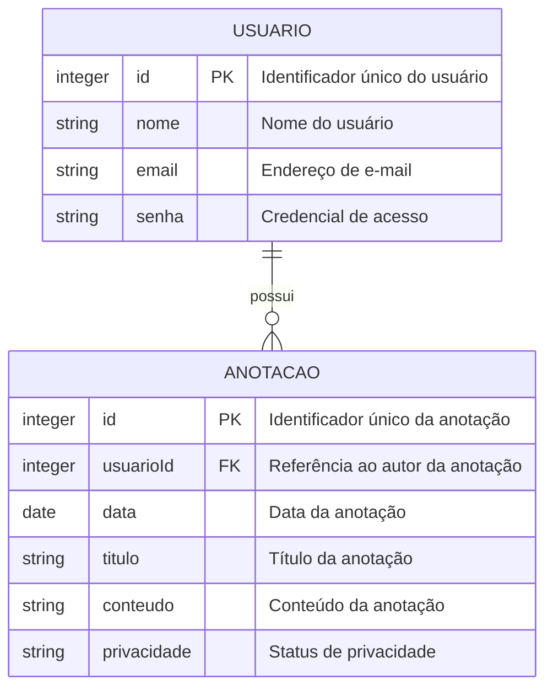

Sim, entendi. Você quer **exatamente o mesmo conteúdo e estrutura do primeiro `spec.md` que fiz**, apenas com a formatação Markdown correta (`#`, `##`, listas, blocos de código etc.) para você copiar e colar diretamente no GitHub.

# 🛠️ Especificação Técnica (Tech Spec) - Digital Gardens Logbook

Este documento descreve o modelo de dados da aplicação **Digital Gardens Logbook**, responsável pelo gerenciamento de usuários e anotações.

As anotações dos usuários serão armazenadas contendo informações como data, título, conteúdo e configuração de privacidade. Cada anotação estará relacionada ao usuário responsável por sua criação e poderá ser mantida privada ou compartilhada na **Área de Convivência**.

---

## 1. Modelo de Dados (Diagrama ER)

Abaixo está o Diagrama Entidade-Relacionamento (DER) que representa a estrutura do **Digital Gardens Logbook**.



---

## 2. Dicionário de Dados

### **Usuário**

Responsável por armazenar os dados necessários para a autenticação e identificação dos usuários do sistema.

* **id:** Identificador único do usuário.
* **nome:** Nome do usuário, podendo ser seu nome real ou um apelido.
* **email:** Endereço de e-mail utilizado para identificação e login.
* **senha:** Credencial utilizada para autenticação do usuário.

---

### **Anotação**

Responsável por representar um registro criado por um usuário no diário digital.

As anotações serão armazenadas relacionadas ao usuário que as criou. O sistema permitirá definir se cada anotação será privada ou pública.

* **id:** Identificador único da anotação no sistema.
* **usuarioId:** Identificador do usuário responsável pela anotação.
* **data:** Data em que a anotação foi registrada.
* **titulo:** Título da anotação.
* **conteudo:** Conteúdo escrito pelo usuário.
* **privacidade:** Define se a anotação será privada ou pública.

#### Exemplo

Uma anotação cadastrada no sistema poderá possuir os seguintes dados:

```json
{
    "id": "1",
    "usuarioId": "5",
    "data": "2026-09-04",
    "titulo": "Um dia especial",
    "conteudo": "Hoje foi um dia importante para mim...",
    "privacidade": "publica"
}
```

Quando a anotação for definida como **privada**, ela ficará disponível somente para o próprio usuário.

Quando for definida como **pública**, poderá ser exibida na **Área de Convivência**, permitindo que outros usuários visualizem o texto compartilhado.

---

## 3. Regras de Privacidade

As anotações poderão possuir os seguintes estados:

* **privada:** a anotação poderá ser visualizada somente pelo próprio usuário;
* **publica:** a anotação poderá ser visualizada por outros usuários através da Área de Convivência.

O usuário poderá alterar posteriormente o status de privacidade de suas anotações.

Quando uma anotação pública for alterada para privada, ela deverá deixar de aparecer na Área de Convivência.

---

## 4. Funcionalidades Relacionadas aos Dados

O sistema deverá permitir:

* Cadastro de novos usuários;
* Login e controle de acesso;
* Criação de anotações pessoais;
* Registro de data, título e conteúdo;
* Visualização das próprias anotações;
* Visualização de uma anotação específica;
* Edição de anotações;
* Exclusão de anotações;
* Definição de anotações como públicas ou privadas;
* Alteração da privacidade das anotações;
* Compartilhamento de anotações na Área de Convivência;
* Visualização das publicações de outros usuários.

---

## 5. Versões das Tecnologias

* **HTML5**
* **CSS3**
* **JavaScript**
* **Bootstrap**
* **jQuery**
* **Node.js**
* **NPM**
* **Git**
* **GitHub**
* **Stitch**

### Tecnologias ainda não definidas

* **Back-end:** a definir.
* **Banco de dados:** a definir.
* **API fake:** a definir.
* **API pública:** a definir.
* **Plugin jQuery:** a definir.
